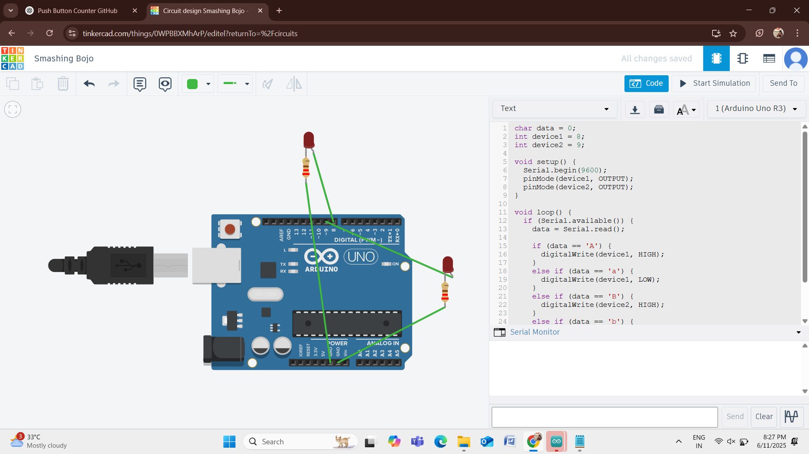

# Bluetooth Controlled Home Automation – CodTech Internship

## 📋 Objective
Control home appliances (like lights/fans) using a smartphone and Bluetooth with Arduino.

## 🧰 Components Used
- Arduino UNO
- HC-05 Bluetooth Module
- Relay Module (or LEDs)
- Jumper wires
- Smartphone (Bluetooth Terminal app)

## 🔌 Circuit Diagram

## 🧠 Working
- Send characters from mobile:
  - `A`: Turn ON Device 1
  - `a`: Turn OFF Device 1
  - `B`: Turn ON Device 2
  - `b`: Turn OFF Device 2

## 🖥️ Output Demo

## ✅ Submitted as Part of
**CodTech Solutions Internship Task – Home Automation**
